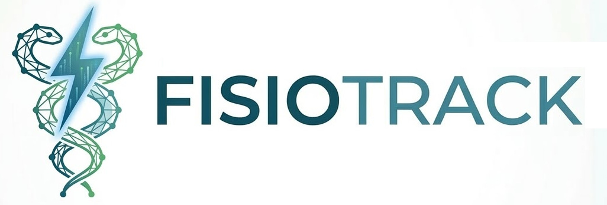

<div align="center">
  
  <p>
    
    
  </p>
</div>

O **FisioTrack** é um sistema de gestão de prontuários para uma clínica de fisioterapia. Uma instalação central mantém o banco SQLCipher criptografado e atende, pela rede local, os computadores autorizados da equipe.

## Funcionalidades

- Cadastro, busca, ordenação, favoritos e prontuário completo de pacientes.
- Avaliações clínicas, importação e exportação JSON/PDF.
- Agenda com detecção de conflitos, notas e histórico de sessões por paciente.
- Auditoria das alterações e expiração de sessões por inatividade.
- Backup local criptografado e integração opcional com Google Drive.
- Interface responsiva para computadores, tablets e celulares da rede interna.

## Arquitetura para a clínica

O backend C++ serve a API e o build React no mesmo endereço. Todos os postos acessam um único processo e um único banco em `database/patients.db`; as operações da API são serializadas para manter transações consistentes entre acessos simultâneos.

```text
computadores da equipe ── rede local ── servidor FisioTrack :8080 ── SQLCipher
```

O sistema opera exclusivamente na rede local. Não encaminhe a porta 8080 no roteador. No firewall do computador servidor, permita essa porta somente para a sub-rede da clínica.

## Pré-requisitos

- CMake 3.20+, compilador C++20, OpenSSL e SQLCipher.
- Node.js 20+ e npm.
- Python 3 e as dependências de `requirements.txt` apenas para Google Drive.

No Arch Linux:

```bash
sudo pacman -S --needed base-devel cmake openssl sqlcipher nodejs npm python
```

No Ubuntu/Debian:

```bash
sudo apt install build-essential cmake libssl-dev libsqlcipher-dev nodejs npm python3
```

## Instalação na rede local

1. Copie a configuração e revise os caminhos:

   ```bash
   cp .env.example .env
   ```

2. Compile e inicie:

   ```bash
   ./runlan.sh build
   ```

3. Descubra o endereço IP do computador servidor e acesse, nos demais computadores:

   ```text
   http://IP-DO-SERVIDOR:8080
   ```

Depois do primeiro build, `./runlan.sh start` inicia sem recompilar. A primeira abertura solicita a criação da senha mestre; as demais solicitam apenas essa senha.

## Banco existente

Se `database/patients.db` ainda não existir, a inicialização procura um único arquivo `.db` sob `database/`, ignorando backups. Quando encontra exatamente um, copia o banco e seus arquivos WAL/SHM para o local principal e preserva a origem.

Se houver mais de um candidato, o servidor não inicia. Escolha explicitamente a origem no `.env`:

```env
DB_MIGRATION_SOURCE=database/importacao/patients.db
```

Mantenha o sistema anterior desligado durante a cópia e valide pacientes, agenda e histórico antes de remover qualquer arquivo antigo.

## Backup

Os backups locais ficam em `database/backups/` e continuam criptografados. Para ativar o Google Drive:

1. Execute `./setup_backup.sh`.
2. Coloque credenciais OAuth do tipo aplicativo para computador em `config/client_secrets.json`.
3. No navegador do próprio computador servidor, abra `http://localhost:8080`, entre no FisioTrack e vincule o Google Drive em Ajustes.

A integração com o Google Drive realiza somente conexões de saída; ela não publica o FisioTrack na internet.

## Desenvolvimento e testes

O menu de desenvolvimento continua disponível:

```bash
./rundev.sh
```

Execução direta dos validadores:

```bash
cmake -S backend -B backend/build
cmake --build backend/build -j"$(nproc)"
./backend/build/unit_tests

cd frontend
CI=true npm test -- --watchAll=false
npm run build
```

## Estrutura

- `backend/`: API, persistência SQLCipher, autenticação, agenda e testes C++.
- `frontend/`: aplicação React/TypeScript e testes de interface.
- `scripts/`: integração opcional de backup.
- `docs/`: contratos da API, banco e formato de importação.
- `database/`: banco e backups locais, ignorados pelo Git.

Os segredos e dados clínicos devem permanecer apenas nos arquivos ignorados `.env`, `config/` e `database/`.
